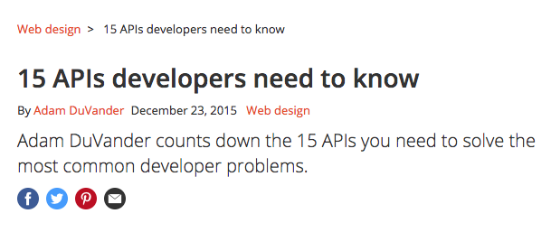

# Kate Byars Travels

#### Author : Kate Byars

## Description

_An application which tracks locations of Instagram photos on a map in a webpage, using Google API and Instagram API._

_._

## Setup/Installation Requirements
Bower, NPM and dependencies as listed in the files uploaded in this application.

* Clone this project from git hub
* install NPM
* initialize npm and bower

## Specifications

| Behavior      | Example Input      | Example Output       |
| ------------- | ------------- | ------------- |
| User can view a map which has a pin for all the places an instagram photo was taken by Kate  | User goes to web page  |  There are the pins!  |

## Inquiries ##
_katebyars5@gmail.com

## Known Bugs
_This project is in progres._
_There is code written to handle server side errors but the return message is not working._
_Site does not return all offices that a doctor works at; only the first office._

## Technologies Used

* _Atom_
* _Gulp_
* _Bower_
* _Google API_
* _Instagram API_

### License

Copyright &copy; 2017 Kate Byars
