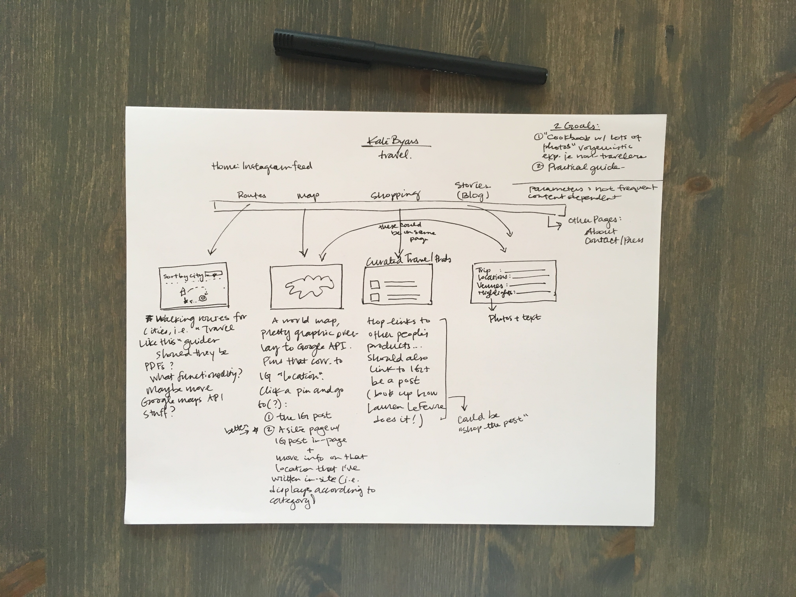
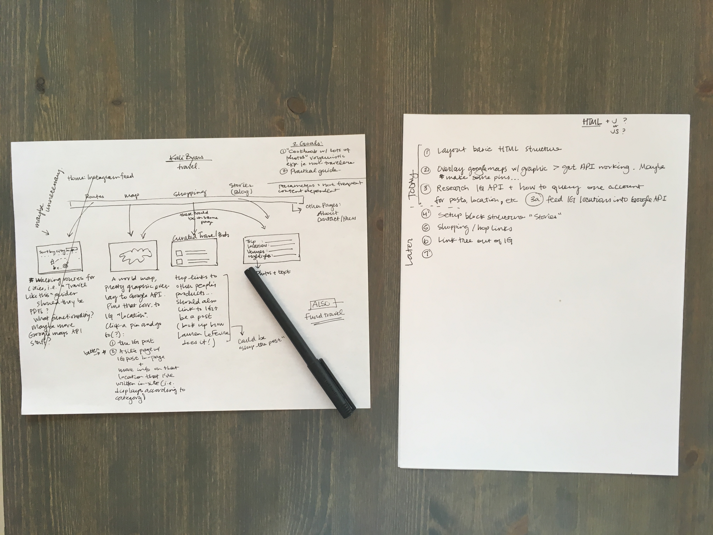

#  How Kate Spent the Day

#### Author : Kate Byars

## Description
_Today I split my day between following up with a recruiter that requested a meeting earlier this week and making a self-study guide for the project I would like to execute (it may need to become an Android app, or part of it can move to an app later): An app that queries my Instagram account and puts locations into Google API so I can have a personalized map on my own "Kate Travels" site, which pairs with my Instagram travel photography account, @katebyars.

__

_Some sketching of new site._

_Short listing the first to-do's._

_Research_

_How to overlay an image on a google map query._

_Get an API Key_

## Initial Project Setup/Installation Requirements
Bower, NPM and dependencies as listed in the files uploaded in this application. I will template off of the Doctor API site I built.

## Self Study Sources : Follow Ups for the Future
_1_

_2_

_3_

_4_

_5_

_6_

## Initial Specifications (one spec may take me a while to research)

| Behavior      | Example Input      | Example Output       |
| ------------- | ------------- | ------------- |
| User can view a map which has a pin for all the places an Instagram photo was taken by Kate  | User goes to web page  |  There are the pins!  |

## Inquiries ##
katebyars5@gmail.com

## Known Bugs
_This project is in progress._

## Technologies Used

* _Atom_
* _Gulp_
* _Bower_
* _Google API_
* _Instagram API_

### License

Copyright &copy; 2017 Kate Byars
