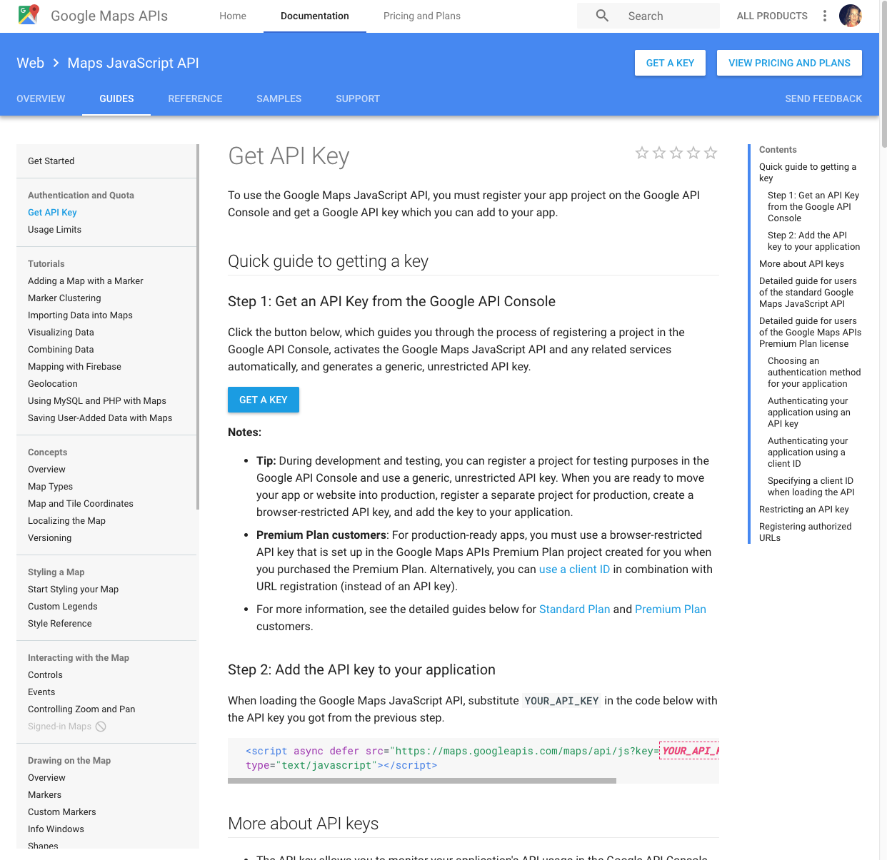

# Kate Byars Travels

#### Author : Kate Byars

## Description: How Kate Spent the Day
_Timeline._

_I would like to build an app that queries my instagram account and puts locations into Google API so I can have a personalized map on my own site:_

_How to overlay an image on a google map query._

_Get an API Key_

## Initial Project Setup/Installation Requirements
Bower, NPM and dependencies as listed in the files uploaded in this application. I will template off of the Doctor API site I built.

## Initial Specifications (one spec may take me a while to research)

| Behavior      | Example Input      | Example Output       |
| ------------- | ------------- | ------------- |
| User can view a map which has a pin for all the places an Instagram photo was taken by Kate  | User goes to web page  |  There are the pins!  |

## Inquiries ##
_katebyars5@gmail.com

## Known Bugs
_This project is in progress._

## Technologies Used

* _Atom_
* _Gulp_
* _Bower_
* _Google API_
* _Instagram API_

### License

Copyright &copy; 2017 Kate Byars
